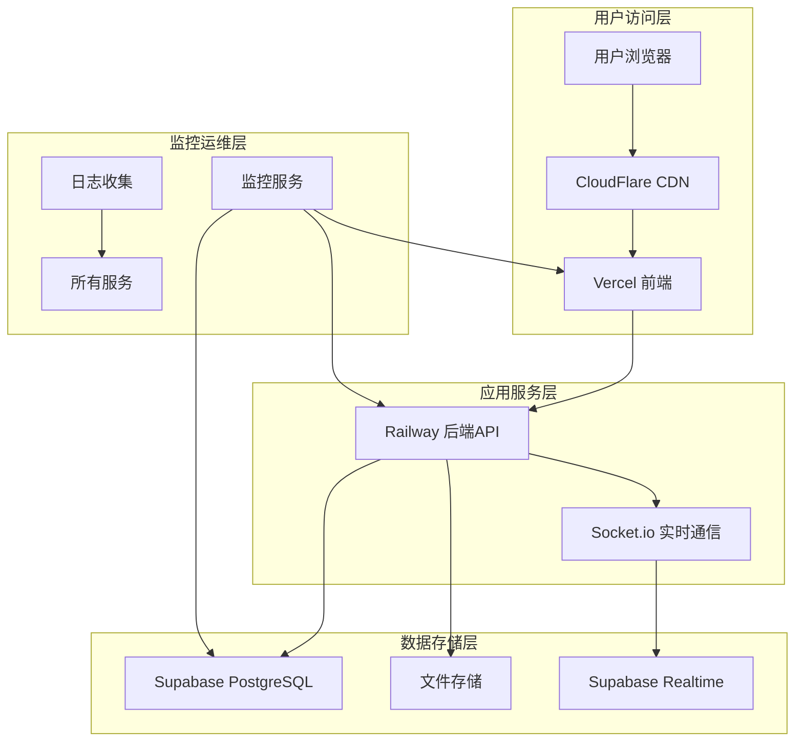
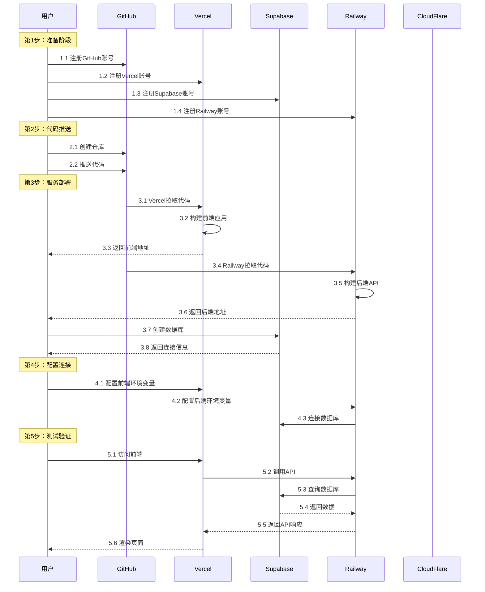
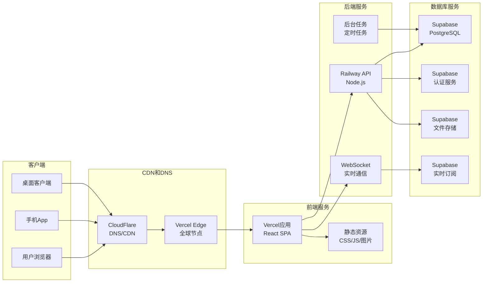

# 🏗️ 企业办公系统部署架构图

## 📊 整体架构概览



---

## 🔄 部署流程时序图



---

## 🌐 网络流量图



---

## 💾 数据流架构

### 1. 用户登录数据流
```
用户输入 → 前端验证 → API请求 → JWT验证 → 数据库查询 → 返回用户信息 → 前端存储Token
```

### 2. 实时聊天数据流
```
用户发送消息 → WebSocket → 后端处理 → 写入数据库 → Realtime推送 → 其他用户接收
```

### 3. 文件上传数据流
```
前端选择文件 → 分片上传 → API验证 → 存储到Supabase Storage → 返回文件URL → 数据库记录
```

### 4. 审批流程数据流
```
创建审批 → 状态变更 → 通知相关人员 → 审批处理 → 更新状态 → 历史记录 → 统计报表
```

---

## 🔧 技术栈架构

### 前端技术栈
```
React 18.x ─┬─ Ant Design 5.x ─┬─ ProComponents
           │                  ├─ Icons
           │                  └─ Charts
           │
           ├─ Vite 5.x ───────┬─ TypeScript
           │                  ├─ PostCSS
           │                  └─ TailwindCSS
           │
           ├─ Zustand 4.x ────┬─ 状态管理
           │                  └─ 持久化存储
           │
           ├─ React Router 6.x
           │
           ├─ Socket.io Client
           │
           └─ ECharts 5.x
```

### 后端技术栈
```
Node.js 20.x ─┬─ Express 4.x ─┬─ 路由管理
             │               ├─ 中间件
             │               ├─ 错误处理
             │               └─ 文件上传
             │
             ├─ TypeScript 5.x
             │
             ├─ Prisma 5.x ──┬─ ORM
             │               ├─ 迁移工具
             │               └─ 客户端
             │
             ├─ JWT 9.x ─────┬─ 认证
             │               └─ 授权
             │
             ├─ Socket.io 4.x
             │
             └─ 安全中间件 ──┬─ Helmet
                           ├─ CORS
                           └─ Rate Limit
```

### 数据库架构
```
PostgreSQL 15.x ─┬─ 用户表 (users)
                ├─ 角色表 (roles)
                ├─ 权限表 (permissions)
                ├─ 部门表 (departments)
                ├─ 审批表 (approvals)
                ├─ 公告表 (announcements)
                ├─ 消息表 (messages)
                ├─ 客户表 (customers)
                ├─ 跟进表 (followups)
                ├─ 报销表 (reimbursements)
                ├─ 文件表 (files)
                └─ 系统配置表 (configs)
```

---

## 🛡️ 安全架构

### 网络安全层
```
1. 传输层安全
   ├─ HTTPS (TLS 1.3)
   ├─ HSTS 强制
   └─ 证书自动续期

2. 应用层安全
   ├─ CORS 白名单
   ├─ CSRF 防护
   ├─ XSS 防护
   └─ 输入验证

3. 认证授权层
   ├─ JWT 令牌
   ├─ Refresh Token
   ├─ RBAC 权限
   └─ 会话管理

4. 数据层安全
   ├─ 数据库加密
   ├─ 行级安全
   ├─ 审计日志
   └─ 数据备份
```

### 访问控制矩阵
| 角色 | 前端访问 | API访问 | 数据库访问 | 文件访问 |
|------|----------|---------|------------|----------|
| 管理员 | 完全访问 | 完全访问 | 完全访问 | 完全访问 |
| 部门主管 | 部门数据 | 部门API | 部门数据 | 部门文件 |
| 普通员工 | 个人数据 | 个人API | 个人数据 | 个人文件 |
| 访客 | 只读访问 | 只读API | 无访问 | 无访问 |

---

## 📈 性能架构

### 1. 前端性能优化
```
代码分割 ─┬─ 路由懒加载
         ├─ 组件懒加载
         └─ 第三方库分割

缓存策略 ─┬─ 浏览器缓存
         ├─ Service Worker
         └─ CDN 缓存

资源优化 ─┬─ 图片压缩
         ├─ 字体优化
         ├─ CSS/JS 压缩
         └─ Tree Shaking
```

### 2. 后端性能优化
```
数据库优化 ─┬─ 索引优化
           ├─ 查询优化
           ├─ 连接池
           └─ 读写分离

API优化 ───┬─ 响应缓存
           ├─ 请求合并
           ├─ 分页处理
           └─ 流式响应

实时优化 ──┬─ WebSocket 连接池
           ├─ 消息队列
           ├─ 广播优化
           └─ 心跳检测
```

### 3. 网络性能优化
```
CDN加速 ─┬─ 静态资源CDN
         ├─ 动态加速
         └─ 边缘计算

协议优化 ─┬─ HTTP/2
         ├─ WebSocket
         └─ QUIC (HTTP/3)
```

---

## 🚀 扩展架构

### 水平扩展方案
```
初始阶段 ────┬─ 单实例前端
            ├─ 单实例后端
            └─ 单数据库

用户增长 ────┬─ 多CDN节点
            ├─ 后端负载均衡
            └─ 数据库读写分离

大规模使用 ──┬─ 微服务架构
            ├─ 分布式数据库
            ├─ 消息队列
            └─ 缓存集群
```

### 功能扩展路线
```
V1.0 基础版 ─┬─ 核心办公功能
            ├─ 基础权限
            └─ 实时聊天

V2.0 增强版 ─┬─ 移动端适配
            ├─ 第三方集成
            ├─ 自动化流程
            └─ 数据分析

V3.0 企业版 ─┬─ 多租户支持
            ├─ 高级安全
            ├─ 自定义工作流
            └─ AI智能助手
```

---

## 🔍 监控架构

### 1. 应用监控
```
性能监控 ─┬─ 页面加载时间
         ├─ API响应时间
         ├─ 数据库查询时间
         └─ 实时消息延迟

错误监控 ─┬─ 前端错误
         ├─ 后端错误
         ├─ 数据库错误
         └─ 网络错误

业务监控 ─┬─ 用户活跃度
         ├─ 功能使用率
         ├─ 转化率
         └─ 业务指标
```

### 2. 基础设施监控
```
服务器监控 ─┬─ CPU使用率
           ├─ 内存使用率
           ├─ 磁盘使用率
           └─ 网络流量

服务监控 ──┬─ Vercel状态
          ├─ Railway状态
          ├─ Supabase状态
          └─ 第三方服务状态

安全监控 ──┬─ 异常登录
          ├─ API滥用
          ├─ 数据泄露
          └─ DDoS攻击
```

### 3. 告警机制
```
实时告警 ─┬─ 服务宕机
         ├─ 性能超标
         ├─ 错误激增
         └─ 安全事件

定时报告 ─┬─ 日报
         ├─ 周报
         ├─ 月报
         └─ 季度报告

自动化处理 ─┬─ 自动重启
           ├─ 自动扩容
           ├─ 自动备份
           └─ 自动修复
```

---

## 💰 成本架构

### 免费套餐资源
```
Vercel ──────┬─ 100GB 带宽/月
            ├─ 无限网站
            ├─ 自动SSL
            └─ 全球CDN

Railway ─────┬─ $5 信用/月
            ├─ 512MB 内存
            ├─ 1GB 存储
            └─ 无限部署

Supabase ────┬─ 500MB 数据库
            ├─ 1GB 文件存储
            ├─ 50MB 带宽/天
            └─ 2个活跃项目

CloudFlare ──┬─ 无限CDN
            ├─ 无限DNS
            ├─ DDoS防护
            └─ SSL证书
```

### 成本控制策略
```
1. 资源优化
   ├─ 压缩静态资源
   ├─ 启用缓存
   ├─ 优化数据库查询
   └─ 减少不必要的请求

2. 监控告警
   ├─ 设置使用额度告警
   ├─ 监控异常流量
   ├─ 定期成本分析
   └─ 优化资源配置

3. 弹性伸缩
   ├─ 按需扩容
   ├─ 自动缩容
   ├─ 使用免费时段
   └─ 选择合适套餐
```

---

## 🎯 部署成功指标

### 技术指标
- ✅ 页面加载时间 < 3秒
- ✅ API响应时间 < 1秒
- ✅ 数据库查询时间 < 100ms
- ✅ 实时消息延迟 < 200ms
- ✅ 系统可用性 > 99.5%

### 业务指标
- ✅ 用户登录成功率 > 99%
- ✅ 核心功能完成率 > 98%
- ✅ 数据一致性 > 99.9%
- ✅ 错误率 < 0.1%
- ✅ 用户满意度 > 4.5/5

### 成本指标
- ✅ 月度成本 < ¥10
- ✅ 资源利用率 > 70%
- ✅ 扩展成本可控
- ✅ 备份成本合理
- ✅ 维护成本可控

---

## 📝 架构决策记录

### ADR-001：选择Monorepo架构
**状态**：已接受  
**上下文**：需要管理多个相关包（前端、后端、共享库）  
**决策**：使用Turbo管理Monorepo  
**后果**：
- 优点：代码共享方便，统一构建，依赖管理简单
- 缺点：学习曲线稍陡，初始配置复杂

### ADR-002：选择免费部署方案
**状态**：已接受  
**上下文**：需要零成本部署方案  
**决策**：使用Vercel+Railway+Supabase组合  
**后果**：
- 优点：完全免费，易于使用，自动扩展
- 缺点：有一定限制，依赖第三方服务

### ADR-003：选择实时通信方案
**状态**：已接受  
**上下文**：需要实时聊天和通知功能  
**决策**：使用Socket.io + Supabase Realtime  
**后果**：
- 优点：实时性好，功能强大，社区支持好
- 缺点：配置复杂，需要WebSocket支持

---

## 🎨 架构图例说明

### 符号说明
```
● 服务节点    ── 数据流
├─ 包含关系    │  并行分支
└─ 结束分支    └─ 选择分支

📱 移动端      🖥️  桌面端
🌐 网络服务    🔒 安全服务
💾 数据存储    ⚡ 实时服务
📊 监控服务    🔄 同步服务
```

### 颜色说明
```
蓝色 (#1890ff)   - 前端服务
绿色 (#52c41a)   - 后端服务
紫色 (#722ed1)   - 数据库服务
橙色 (#fa8c16)   - 实时服务
红色 (#f5222d)   - 监控告警
灰色 (#bfbfbf)   - 基础设施
```

---

## 🔄 架构演进路线

### 阶段1：MVP部署（当前）
```
架构：单体应用 + 免费云服务
用户：< 50人
成本：¥0/月
重点：功能完整性，部署简单性
```

### 阶段2：增长阶段
```
架构：微服务 + 混合云
用户：50-200人
成本：¥500-1000/月
重点：性能优化，扩展性
```

### 阶段3：企业级
```
架构：分布式 + 私有云
用户：200+人
成本：¥2000+/月
重点：高可用，安全性，合规性
```

---

**架构图使用说明**：
1. 部署前查看整体架构图，理解各组件关系
2. 部署时参考部署流程图，按步骤操作
3. 部署后参考监控架构图，设置监控告警
4. 扩展时参考扩展架构图，规划升级路线

**架构图更新**：随着系统发展和需求变化，架构图需要定期更新以反映最新状态。